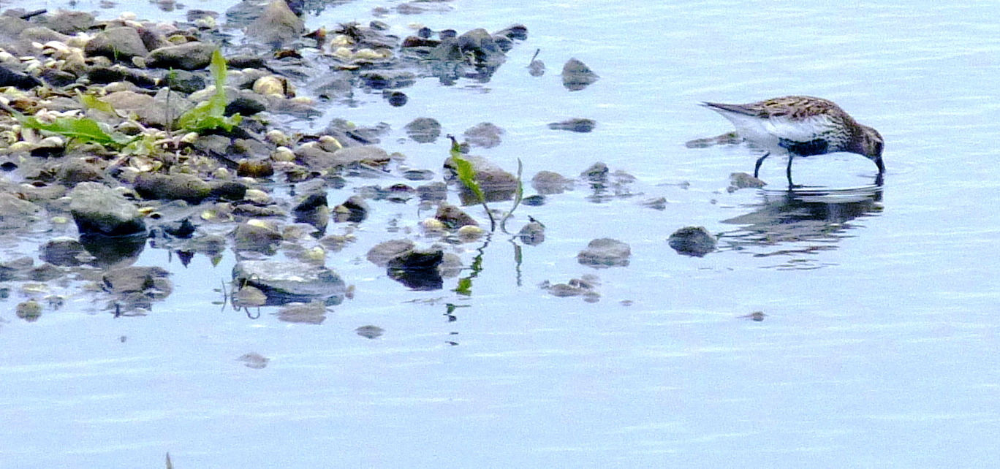

    <input id="search"  type="text" placeholder="Search the list" autocomplete="off" autofocus>

    <ul id="bird-list">
        
            <li id="{{ bird.name | slugify }}">
                <h2>{{ bird.name }} </h2>
                <h3>({{ bird.latin }}) </h3>
                
{{ bird.text | markdownify }}

            </li>
        
    </ul>

